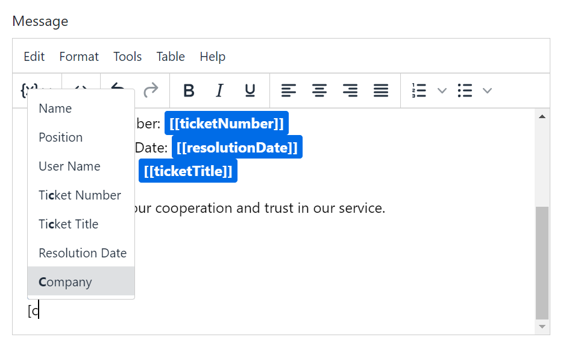
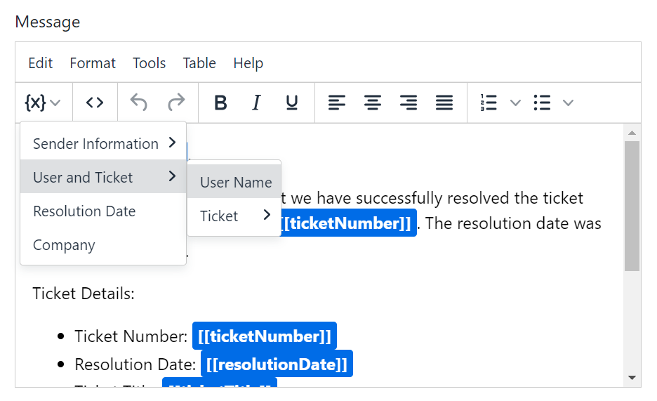

# TinyMCE VarTags

VarTags is a versatile plugin designed to simplify the management of customization variables within your text. This plugin streamlines the process of incorporating dynamic variables into your content, making it user-friendly and efficient.

## Features

- **Easy Integration:** Seamlessly incorporate customization variables into your text content.

- **Versatility:** Suitable for various applications, VarTags caters to the diverse needs of web developers and content creators.

  - VarTags can be inserted by either selecting them from a dropdown list when typing a specific prefix
    
  - or by selecting and inserting them from the menu button in the toolbar.
    

  Once a VarTag is inserted, the plugin encapsulates it with a non-editable variable.

## How to Use

1. **Integration:**

   - Include the VarTags plugin in your project.

```html
<script src="your/path/to/vartags/plugin.min.js"></script>
```

2. **Usage:**
   - To incorporate the 'vartags' plugin in TinyMCE, follow the example below:

```javascript
// Example Usage
window.tinymce.init({
  selector: 'your_selector',
  plugins: 'vartags',
  toolbar: 'vartagsbtn',
  vartags_prefix: '[*',
  vartags_suffix: '*]',
  vartags_items: []
});
```

## VarTags Configuration Options

When using the VarTags plugin, you can customize its behavior with the following configuration options:

- **`toolbar: 'vartagsbtn'`:** Add the 'vartagsbtn' button to the toolbar, providing a convenient way for users to interact with VarTags.

- **`vartags_prefix: '[*'`:** Specify the prefix to identify the beginning of a variable tag. For example, if set to `[*` as shown in the example, a variable tag might look like `[*variableName*]` .

- **`vartags_suffix: '*]'`:** Define the suffix to identify the end of a variable tag. Using the example, a complete variable tag would be `[*variableName*]`.

- **`vartags_items: []`:** Populate this array with predefined variable items that users can select from when working with VarTags. Each item in the array should be an object with 'title' and 'value' properties. Additionally, you can include a `menu` property with an array of objects, each having 'title' and 'value' properties. This allows for nested menu structures. For example:

```javascript
vartags_items: [
  { title: 'User Name', value: 'userName' },
  { title: 'Ticket Number', value: 'ticketNumber' },
  {
    title: 'Ticket Menu',
    menu: [
      { title: 'Ticket Title', value: 'ticketTitle' },
      { title: 'Priority', value: 'priority' }
      // Add more items as needed
    ]
  }
  // Add more items as needed
];
```

## Benefits

- **Enhanced User Experience:** Improve the overall user experience by providing a straightforward solution for handling customization variables.

- **Time-Efficient:** Save time and effort by utilizing VarTags to streamline the integration of dynamic variables.

## Getting Started

1. **Installation:**

   - Download the VarTags plugin and include it in your project..

2. **Configuration:**

   - Integrate the plugin into your TinyMCE setup.

3. **Implementation:**
   - Begin using VarTags to enhance your text content with dynamic customization variables.

## Contributions

We welcome contributions from the community to enhance the functionality and features of VarTags. Feel free to submit bug reports, feature requests, or pull requests on our repository.

## License

VarTags is released under the [MIT License](LICENSE). Feel free to use, modify, and distribute this plugin according to the terms of the license.
